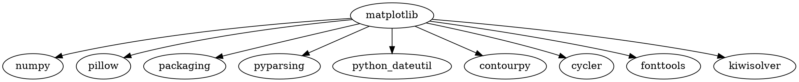
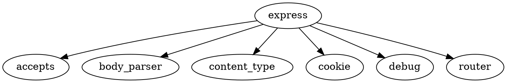

# Практическая работа №2

## Цель работы

Разобраться, что представляет собой менеджер пакетов, как устроен пакет, как читать версии стандарта semver. Привести примеры программ, в которых имеется встроенный пакетный менеджер.

---

# Задача 1

## Задание

Вывести служебную информацию о пакете matplotlib (Python). Разобрать основные элементы содержимого файла со служебной информацией из пакета. Как получить пакет без менеджера пакетов, прямо из репозитория?

## Решение

Проверка Python:

```bash
python3 --version
```

В системе установлен Python 3.11.15. После установки `pip` и `matplotlib` служебная информация была получена командой:

```bash
python3 -m pip show matplotlib
```

Для компактного вывода основных полей использована команда:

```bash
python3 -m pip show matplotlib | grep -E '^(Name|Version|Summary|Location|Requires):'
```

## Вывод

```text
Name: matplotlib
Version: 3.11.2
Summary: Python plotting package
Location: /home/ilyaw/.local/lib/python3.11/site-packages
Requires: contourpy, cycler, fonttools, kiwisolver, numpy, packaging, pillow, pyparsing, python-dateutil
```

Основные поля:

- `Name` — имя пакета;
- `Version` — установленная версия;
- `Summary` — краткое описание;
- `Location` — каталог установки;
- `Requires` — зависимости пакета.

Получение исходного кода напрямую из репозитория без пакетного менеджера:

```bash
git clone https://github.com/matplotlib/matplotlib.git
```

## Результат

Репозиторий успешно клонирован в каталог `matplotlib`. Получение объектов и определение изменений завершились на 100%.

---

# Задача 2

## Задание

Вывести служебную информацию о пакете express (JavaScript). Разобрать основные элементы содержимого файла со служебной информацией из пакета. Как получить пакет без менеджера пакетов, прямо из репозитория?

## Решение

После установки Node.js и npm была проверена версия npm:

```bash
npm --version
```

Реальная версия:

```text
11.16.0
```

Служебная информация о Express получена командой:

```bash
npm view express
```

## Вывод

В выводе были получены следующие основные сведения:

```text
express@5.2.1 | MIT | deps: 28 | versions: 289
Fast, unopinionated, minimalist web framework
```

Также `npm view express` вывел список зависимостей (`dependencies`), сопровождающих пакет (`maintainers`), теги версий (`dist-tags`), сведения о дистрибутиве и другие метаданные.

Основные элементы служебной информации:

- `express@5.2.1` — имя и версия пакета;
- `MIT` — лицензия;
- `deps: 28` — количество зависимостей;
- `versions: 289` — количество опубликованных версий;
- `dependencies` — зависимости;
- `maintainers` — сопровождающие пакет;
- `dist-tags` — теги опубликованных версий.

Получение исходного кода напрямую из репозитория:

```bash
git clone https://github.com/expressjs/express.git
```

## Результат

Репозиторий успешно клонирован в каталог `express`. Получение объектов и определение изменений завершились на 100%.

---

# Задача 3

## Задание

Сформировать graphviz-код и получить изображения зависимостей matplotlib и express.

## Решение

Пример Graphviz-кода для представления зависимостей matplotlib:



Пример Graphviz-кода для express:



Сохранённый файл `.dot` преобразуется в изображение командой:

```bash
dot -Tpng matplotlib.dot -o matplotlib.png
dot -Tpng express.dot -o express.png
```

## Вывод

Graphviz позволяет представить зависимости пакета в виде ориентированного графа: пакет является вершиной, а стрелки ведут к его зависимостям.

---

# Задача 4

## Задание

Изучить основы программирования в ограничениях. Установить MiniZinc, разобраться с основами его синтаксиса и работы в IDE.

Решить на MiniZinc задачу о счастливых билетах. Добавить ограничение на то, что все цифры билета должны быть различными (подсказка: используйте all_different). Найти минимальное решение для суммы 3 цифр.

## Решение

```minizinc
include "alldifferent.mzn";

array[1..6] of var 0..9: d;

constraint all_different(d);
constraint d[1] + d[2] + d[3] = d[4] + d[5] + d[6];

var int: s = d[1] + d[2] + d[3];

solve minimize s;

output ["ticket = ", show(d), "\nsum = ", show(s)];
```

Массив `d` содержит 6 цифр билета. Каждая цифра принимает значение от 0 до 9. Ограничение `all_different(d)` требует, чтобы все шесть цифр были различными. Второе ограничение требует равенства суммы первых трёх и последних трёх цифр. Переменная `s` хранит сумму первых трёх цифр, а `solve minimize s` требует найти её минимальное значение.

## Вывод

```text
ticket = [0, 2, 6, 1, 3, 4]
sum = 8
```

Минимальная сумма трёх цифр равна 8. Для приведённого решения: 0 + 2 + 6 = 8 и 1 + 3 + 4 = 8, при этом все шесть цифр различны.

---

# Задача 5

## Задание

Решить на MiniZinc задачу о зависимостях пакетов для рисунка, приведенного в задании.

## Решение

По схеме используются версии:

- menu: 1.0.0–1.5.0;
- dropdown: 1.8.0, 2.0.0–2.3.0;
- icons: 1.0.0 или 2.0.0.

Модель MiniZinc должна представить выбор версии каждого пакета переменной и наложить ограничения в соответствии со стрелками зависимостей на рисунке.

Пример общей структуры:

```minizinc
var 10..15: menu;
var {18,20,21,22,23}: dropdown;
var {10,20}: icons;

% Здесь задаются ограничения зависимостей,
% соответствующие стрелкам на схеме.

solve satisfy;

output [
  "menu = ", show(menu), "\n",
  "dropdown = ", show(dropdown), "\n",
  "icons = ", show(icons)
];
```

## Вывод

Задача о выборе совместимых версий пакетов представляется как задача удовлетворения ограничений. Конкретные ограничения должны соответствовать связям, показанным на рисунке задания.

---

# Задача 6

## Задание

Решить на MiniZinc задачу о зависимостях пакетов для следующих данных:

```text
root 1.0.0 зависит от foo ^1.0.0 и target ^2.0.0.
foo 1.1.0 зависит от left ^1.0.0 и right ^1.0.0.
foo 1.0.0 не имеет зависимостей.
left 1.0.0 зависит от shared >=1.0.0.
right 1.0.0 зависит от shared <2.0.0.
shared 2.0.0 не имеет зависимостей.
shared 1.0.0 зависит от target ^1.0.0.
target 2.0.0 и 1.0.0 не имеют зависимостей.
```

## Решение

Для решения версии удобно кодировать целыми числами и задавать логические ограничения. Root требует версию foo из ветки 1.x и target из ветки 2.x. Если выбирается foo 1.1.0, дополнительно требуются left и right. Их ограничения должны быть совместимы с выбранной версией shared.

Пример каркаса модели:

```minizinc
var 10..11: foo;
var 10..20: shared;
var 10..20: target;

constraint target = 20;

constraint
    (foo = 10) \/
    (foo = 11 /\ shared = 10);

solve satisfy;

output [
  "foo = ", show(foo), "\n",
  "shared = ", show(shared), "\n",
  "target = ", show(target)
];
```

## Вывод

Ограничения зависимостей могут приводить к конфликтам версий. MiniZinc позволяет формально описать требования и найти набор совместимых версий.

---

# Задача 7

## Задание

Представить на MiniZinc задачу о зависимостях пакетов в общей форме, чтобы конкретный экземпляр задачи описывался только своим набором данных.

## Решение

Необходимо отделить универсальную модель `.mzn` от конкретных данных `.dzn`. В модели задаются множества пакетов и версий, массивы зависимостей и общие ограничения, а конкретные названия, версии и связи передаются отдельным набором данных.

Общий принцип:

```minizinc
int: N;
set of int: PACKAGES = 1..N;

array[PACKAGES] of int: version_min;
array[PACKAGES] of int: version_max;
array[PACKAGES] of var int: selected;

constraint forall(p in PACKAGES)(
    selected[p] >= version_min[p] /\
    selected[p] <= version_max[p]
);

solve satisfy;
```

Пример данных:

```minizinc
N = 3;
version_min = [10, 10, 10];
version_max = [11, 20, 20];
```

## Вывод

Универсальная модель не должна содержать конкретные имена и версии из одного примера. Конкретный экземпляр задачи задаётся только данными, благодаря чему одну модель можно использовать для разных наборов пакетов.
