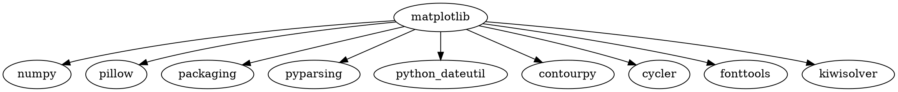
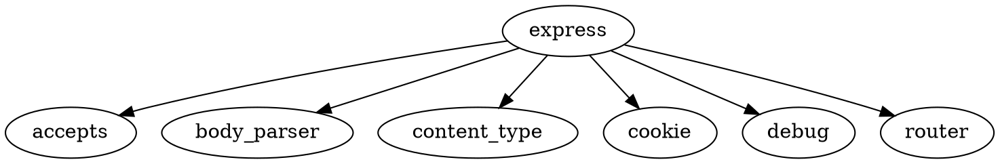

# Практическая работа №2

## Цель работы

Разобраться, что представляет собой менеджер пакетов, как устроен пакет, как читать версии стандарта semver. Привести примеры программ, в которых имеется встроенный пакетный менеджер.

---

# Задача 1

## Задание

Вывести служебную информацию о пакете matplotlib (Python). Разобрать основные элементы содержимого файла со служебной информацией из пакета. Как получить пакет без менеджера пакетов, прямо из репозитория?

## Решение

Служебную информацию об установленном пакете можно получить командой:

```bash
python3 -m pip show matplotlib
```

Для просмотра метаданных установленного пакета:

```bash
python3 -m pip show -f matplotlib
```

Основные элементы служебной информации: Name — имя пакета; Version — версия; Summary — краткое описание; Home-page/Project-URL — адрес проекта; Author/Author-email — сведения об авторе; License — лицензия; Location — место установки; Requires — зависимости; Required-by — пакеты, зависящие от matplotlib.

Получить исходный код без пакетного менеджера можно непосредственно из репозитория проекта с помощью Git:

```bash
git clone https://github.com/matplotlib/matplotlib.git
```

## Вывод

Команды позволяют посмотреть служебную информацию, версию, расположение и зависимости matplotlib. Исходный код можно получить непосредственно из Git-репозитория.

---

# Задача 2

## Задание

Вывести служебную информацию о пакете express (JavaScript). Разобрать основные элементы содержимого файла со служебной информацией из пакета. Как получить пакет без менеджера пакетов, прямо из репозитория?

## Решение

Информацию о пакете можно получить через npm:

```bash
npm view express
```

Для просмотра метаданных в формате JSON:

```bash
npm view express --json
```

В JavaScript-пакетах основные метаданные находятся в `package.json`: name — имя; version — версия; description — описание; main — точка входа; scripts — команды; dependencies — зависимости; devDependencies — зависимости для разработки; repository — репозиторий; license — лицензия.

Получить пакет напрямую из репозитория:

```bash
git clone https://github.com/expressjs/express.git
```

## Вывод

npm позволяет получить метаданные express, а package.json описывает пакет и его зависимости. Исходный код можно получить напрямую из Git-репозитория.

---

# Задача 3

## Задание

Сформировать graphviz-код и получить изображения зависимостей matplotlib и express.

## Решение

Пример Graphviz-кода для представления зависимостей matplotlib:



Пример Graphviz-кода для express:



Сохранённый файл `.dot` преобразуется в изображение командой:

```bash
dot -Tpng matplotlib.dot -o matplotlib.png
dot -Tpng express.dot -o express.png
```

## Вывод

Graphviz позволяет представить зависимости пакета в виде ориентированного графа: пакет является вершиной, а стрелки ведут к его зависимостям.

---

# Задача 4

## Задание

Изучить основы программирования в ограничениях. Установить MiniZinc, разобраться с основами его синтаксиса и работы в IDE.

Решить на MiniZinc задачу о счастливых билетах. Добавить ограничение на то, что все цифры билета должны быть различными (подсказка: используйте all_different). Найти минимальное решение для суммы 3 цифр.

## Решение

Пример модели MiniZinc:

```minizinc
include "alldifferent.mzn";

array[1..6] of var 0..9: d;

constraint all_different(d);
constraint d[1] + d[2] + d[3] = d[4] + d[5] + d[6];

var int: s = d[1] + d[2] + d[3];

solve minimize s;

output ["ticket = ", show(d), "\nsum = ", show(s)];
```

Массив `d` содержит шесть цифр билета. Ограничение равенства сумм первых и последних трёх цифр задаёт счастливый билет, а `all_different(d)` требует различия всех цифр. Команда `solve minimize s` ищет решение с минимальной суммой трёх цифр.

## Вывод

Модель формулирует задачу как набор переменных и ограничений, после чего MiniZinc самостоятельно выполняет поиск минимального допустимого решения.

---

# Задача 5

## Задание

Решить на MiniZinc задачу о зависимостях пакетов для рисунка, приведенного в задании.

## Решение

По схеме используются версии:

- menu: 1.0.0–1.5.0;
- dropdown: 1.8.0, 2.0.0–2.3.0;
- icons: 1.0.0 или 2.0.0.

Модель MiniZinc должна представить выбор версии каждого пакета переменной и наложить ограничения в соответствии со стрелками зависимостей на рисунке.

Пример общей структуры:

```minizinc
var 10..15: menu;
var {18,20,21,22,23}: dropdown;
var {10,20}: icons;

% Здесь задаются ограничения зависимостей,
% соответствующие стрелкам на схеме.

solve satisfy;

output [
  "menu = ", show(menu), "\n",
  "dropdown = ", show(dropdown), "\n",
  "icons = ", show(icons)
];
```

## Вывод

Задача о выборе совместимых версий пакетов представляется как задача удовлетворения ограничений. Конкретные ограничения должны соответствовать связям, показанным на рисунке задания.

---

# Задача 6

## Задание

Решить на MiniZinc задачу о зависимостях пакетов для следующих данных:

```text
root 1.0.0 зависит от foo ^1.0.0 и target ^2.0.0.
foo 1.1.0 зависит от left ^1.0.0 и right ^1.0.0.
foo 1.0.0 не имеет зависимостей.
left 1.0.0 зависит от shared >=1.0.0.
right 1.0.0 зависит от shared <2.0.0.
shared 2.0.0 не имеет зависимостей.
shared 1.0.0 зависит от target ^1.0.0.
target 2.0.0 и 1.0.0 не имеют зависимостей.
```

## Решение

Для решения версии удобно кодировать целыми числами и задавать логические ограничения. Root требует версию foo из ветки 1.x и target из ветки 2.x. Если выбирается foo 1.1.0, дополнительно требуются left и right. Их ограничения должны быть совместимы с выбранной версией shared.

Пример каркаса модели:

```minizinc
var 10..11: foo;
var 10..20: shared;
var 10..20: target;

constraint target = 20;

constraint
    (foo = 10) \/
    (foo = 11 /\ shared = 10);

solve satisfy;

output [
  "foo = ", show(foo), "\n",
  "shared = ", show(shared), "\n",
  "target = ", show(target)
];
```

## Вывод

Ограничения зависимостей могут приводить к конфликтам версий. MiniZinc позволяет формально описать требования и найти набор совместимых версий.

---

# Задача 7

## Задание

Представить на MiniZinc задачу о зависимостях пакетов в общей форме, чтобы конкретный экземпляр задачи описывался только своим набором данных.

## Решение

Необходимо отделить универсальную модель `.mzn` от конкретных данных `.dzn`. В модели задаются множества пакетов и версий, массивы зависимостей и общие ограничения, а конкретные названия, версии и связи передаются отдельным набором данных.

Общий принцип:

```minizinc
int: N;
set of int: PACKAGES = 1..N;

array[PACKAGES] of int: version_min;
array[PACKAGES] of int: version_max;
array[PACKAGES] of var int: selected;

constraint forall(p in PACKAGES)(
    selected[p] >= version_min[p] /\
    selected[p] <= version_max[p]
);

solve satisfy;
```

Пример данных:

```minizinc
N = 3;
version_min = [10, 10, 10];
version_max = [11, 20, 20];
```

## Вывод

Универсальная модель не должна содержать конкретные имена и версии из одного примера. Конкретный экземпляр задачи задаётся только данными, благодаря чему одну модель можно использовать для разных наборов пакетов.
